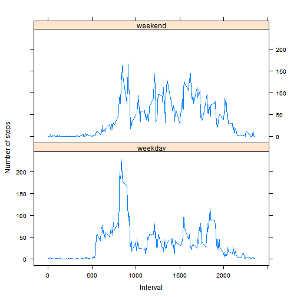

## Loading and preprocessing the data

Step1:Load the data from activity.csv using read.csv


```r
colcls = c("integer","character","integer")
df<-read.csv("activity.csv", head=TRUE, colClasses=colcls,na.strings="NA")
head(df)
```

```
##   steps       date interval
## 1    NA 2012-10-01        0
## 2    NA 2012-10-01        5
## 3    NA 2012-10-01       10
## 4    NA 2012-10-01       15
## 5    NA 2012-10-01       20
## 6    NA 2012-10-01       25
```

Step2:Process /Transform the data into a format suitable for analysis.  
      1. Type of Date column modified.  
      2. Removed all rows containing "NA"  
      3.Modified Data stored in New Data Frame df_new       


```r
df$date<-as.Date(df$date)
df_new <- subset(df , !is.na(df$steps))
```

## What is mean total number of steps taken per day?

Step1:Calculate the total number of steps taken per day and generate histogram


```r
dailysum<- tapply(df_new$steps, df_new$date, sum, na.rm=TRUE,simplify = T)
dailysum<-dailysum[!is.na(dailysum)]

hist(x=dailysum,col="blue",breaks=20,xlab="Daily Total Steps",ylab="Frequency",main="The distribution of daily total number of steps excluding missing data"
     )
```

 


Step2:Calculate and report the mean and median of the total number of steps taken per day


```r
mean(dailysum)
```

```
## [1] 10766.19
```


```r
median(dailysum)
```

```
## [1] 10765
```
## What is the average daily activity pattern?

Step1:Create a time series plot(i.e type="I")of the 5 minute interval (x-axis) and the average number of steps taken ,average across all days(y-axis)


```r
int_avg<- tapply(df_new$steps, df_new$interval, mean, na.rm=TRUE,simplify = T)
df_av<- data.frame(interval=as.integer(names(int_avg)), avg=int_avg)

with(df_av,     
     plot(interval,          
          avg,          
          type="l",          
          xlab="5-minute intervals",          
          ylab="average steps in the interval across all days"))
```

 

Step2:Check which 5-minute interval ,on average across all the days in the dataset , contains the maximum number of steps

```r
max_steps <- max(df_av$avg)
df_av[df_av$avg == max_steps, ]
```

```
##     interval      avg
## 835      835 206.1698
```

## Imputing missing values

Step1:Calculate and report total number of missing values in the dataset 

```r
sum(is.na(df$steps))
```

```
## [1] 2304
```
Original data set has 2304 rows with missing data

Step2:Strategy :if a 5 minute interval is missing ,using mean for that 5 minute interval.
          
Step3:Creating new data frame df_inpmis from the original dataframe df with missing data 
          filled in with mean for that interval.
          

```r
df_inpmis<-df

ndf<-is.na(df_inpmis$steps)
int_avg<-tapply(df_new$steps,df_new$interval,mean,na.rm=TRUE,simplify = T)
df_inpmis$steps[ndf]<-int_avg[as.character(df_inpmis$interval[ndf])]
```

Step4:Generate histogram of the total number of steps taken each day and Calculate and report the mean and median total number of steps taken per day .

```r
new_dailysum<-tapply(df_inpmis$steps,df_inpmis$date,sum,na.rm=TRUE,simplify=T)

hist(x=new_dailysum,
     col="blue",
     breaks=20,
     xlab="daily steps",
     ylab="frequency",
     main="The distribution of daily total after inputting the missing data")
```

 


```r
mean(new_dailysum)
```

```
## [1] 10766.19
```


```r
median(new_dailysum)
```

```
## [1] 10766.19
```
New mean is 10766 and new median is 10766. 
Original mean 10766 and median 10765.
Observation :Mean does not change and median has small change .As for missing data for intervals ,mean is used we have more data close or identical to the means and median is shifted and becomes identical to the mean .

Impact: Higher frequency counts at the center region (close to the mean)

## Are there differences in activity patterns between weekdays and weekends?

Step1:Crete new factor variable in the dataset with two levels-"weekday" and "weekend" indicating whether a given date is a weekday or weekend day .

```r
is_weekday<- function(d){
  wd<-weekdays(d)
  ifelse(wd == "Saturday" | wd == "Sunday", "weekend", "weekday")
}

wx<-sapply(df_inpmis$date,is_weekday)
df_inpmis$wk<- as.factor(wx)
head(df_inpmis)
```

```
##       steps       date interval      wk
## 1 1.7169811 2012-10-01        0 weekday
## 2 0.3396226 2012-10-01        5 weekday
## 3 0.1320755 2012-10-01       10 weekday
## 4 0.1509434 2012-10-01       15 weekday
## 5 0.0754717 2012-10-01       20 weekday
## 6 2.0943396 2012-10-01       25 weekday
```

Step2:Make a panel plot containing a time series plot ("i.e type = "1") of the 5 minute interval (x-axis) and the average number of steps taken,averaged across all weekday days or weekend days(y-axis). ")


```r
wk_df <- aggregate(steps ~ wk+interval, data=df_inpmis, FUN=mean)

library(lattice)
xyplot(steps ~ interval | factor(wk),       
       layout = c(1, 2),       
       xlab="Interval",      
       ylab="Number of steps",       
       type="l",       
       lty=1,       
       data=wk_df)
```

 

